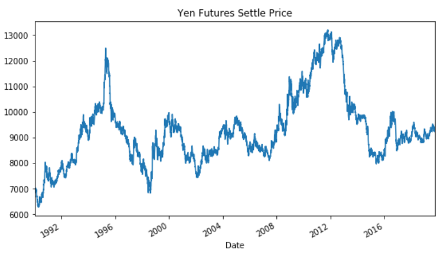

# Time Series Forecasting and Linear Regression Modeling

## Predicting Future Movements in the Value of Japanese yen verse the U.S. dollar

#### Time-Series Forecasting

In this assignment, historical Dollar-Yen exchange rate futures data was used to apply time series analysis and modeling to determine whether there was any predictable behavior.

Summary of Analysis: 

1. Decomposition using a Hodrick-Prescott Filter (Decompose the Settle price into trend and noise)
2. Forecasting Returns using an ARMA Model
3. Forecasting the Settle Price using an ARIMA Model
4. Forecasting Volatility with GARCH

Below is a chart of historical Yen-USD futures settle prices. There looks to be a long-term trend of the Yen strengthening against the Dollar and therefore, a potential long-term investment opportunity to explore. 

In dissecting the historical Settle price into trend and noise using the Hodrick-Prescott Filter, another relationship emerges. Based on the plot below of the Settle price verse Trend line, the actual Yen settle price significantly fluctuates from the trend line. These fluctuations could represent short term buying opportunities when the Yen settle price falls below the trend line.  

Looking more closely at the Settle price verse Trend line, as of 10/15/2019, the Yen sits below the trend line indicating a potential near-term buying opportunity.

### Forecasting Returns using an ARMA Model

The ARMA model was run to determine if settle price returns are strong predictors of future returns. In this analysis, AR and MA parameters were set to order=(2, 1). Based on the results, the model forecasts returns to decline over the next 5-day period. 

But the summary of the model's results shows coefficients with p-values greater than 0.05 and therefore, not statistically significant. I would not be confident using this model. The prior days' returns do not appear to be good predictors of future returns. 

### Forecasting the Settle Price using an ARIMA Model

The ARIMA model was run on the raw Yen Settle Price with 5 auto-regressive lags and 1 moving average lag; order=(5,1,1). Based on the results, the model forecasts the Japanese Yen Settle Price will move higher in the near term. 

But the summary of results shows p-values of the lag coefficients to be greater than 0.05, therefore, not statistically significant. I would not be confident using this model.   

 

### Volatility Forecasting with GARCH

The GARCH model was used to forecast near-term volatility of Japanese Yen futures returns. The parameters were set to order=(2,1). Based on the results, the model forecasts risk to increase over the next five days. 

Based on the model's summary of results, the one-day lag is less than 0.05 and the two-day lag is greater than 0.05. The one-day lag of volatility is statistically significant indicating a relationship between yesterday's volatility to today's volatility in the Settle price. The two-day lag does not show statistical significance; therefore, I would reduce the parameter p to a value of 1. I would be confident using this model.    

In summary, the Yen price chart indicates a long-term trend of strengthening against the Dollar and would potentially make a great long-term investment. Based on more recent data analysis, the Yen currently sits below the trend line and may also be a short-term buying opportunity. Unfortunately, the ARMA and ARIMA models did not show statistical significance and therefore, do not provide additional insight into the direction of future returns or settle prices. But the GARCH model does appear to be helpful in the analysis and predicts higher risk in the near term to monitor. 

#### Linear Regression Forecasting

In this part of the analysis, a regression model was used to predict Yen futures settle returns with lagged Yen futures returns. 

The steps below were completed

1. Data Preparation: Creating Returns and Lagged Returns, splitting the data into training and testing data
2. Fitting a Linear Regression Model
3. Making predictions using the testing data
4. Out-of-sample performance
5. In-sample performance

The training data included yen returns from 2014-2018 and the testing data used 2018-2019.

Once the model was fit using the training data, predictions were made with the model using the test dataset. Below is the output of predictions from the model verse the actual data. Per the plot below, the linear regression model does a poor job of predicting Yen futures returns with lagged Yen futures returns. 

The root mean squared errors were calculated: 0.41% on in-sample data and 0.57% on out-of-sample data. The model does perform better on out-of-sample data compared to in-sample data given the lower root mean squared error. This could be due to the smaller data set used in testing and therefore, a lower level of noise. If this test is performed several more times with different time series data selected for training and testing data, I would expect the out-of-sample error to be larger than the in-sample error.
